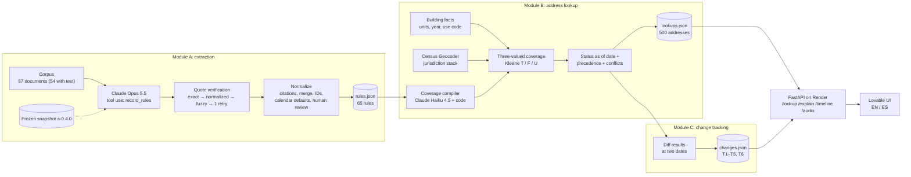

# Rental Housing Law Navigator

**Which rental-housing rules apply at this address today, and why?** An AI pipeline reads a
corpus of real U.S. housing law (California, New Jersey, Massachusetts and ten cities), turns
it into cited rule records, and answers per apartment address and query date, with a literal
quote, a citation and a confidence score behind every answer.

| | |
|---|---|
| 🖥️ **Live demo** | https://scene-styler-kit.lovable.app |
| 🔌 **API** | https://rental-housing-navigator-api.onrender.com · interactive docs at [`/docs`](https://rental-housing-navigator-api.onrender.com/docs) · contract in [docs/API.md](docs/API.md) |
| 🧩 **Frontend repo (Lovable)** | https://github.com/elbicho707/Rental-Housing-Lovable (mirrored in [`frontend/`](frontend/) at commit `54768b0`) |
| 🎬 **Videos** | Videos (team intro, demo, technical; ≤ 60 s each) were submitted through the Hack-Nation portal. Narration of the demo and technical videos is an AI voice (ElevenLabs). |
| 📄 **Method note** | [docs/METHOD.md](docs/METHOD.md) · [PDF](docs/METHOD.pdf) |

> ⚖️ **Not legal advice.** This is an information prototype built for the **7th Global AI
> Hackathon · Hack-Nation × RealPage**, challenge 02: *Rental Housing Law Navigator*. It is not legal counsel or a compliance
> certification. Every answer links to its source; check it and consult a qualified
> professional before acting.

> ⏱️ The API runs on Render's free plan. The first request after it has been idle can take
> **about a minute** while it wakes up.

---

## Contents

1. [Results at a glance](#results-at-a-glance)
2. [How it works](#how-it-works)
3. [Module A — rule extraction](#module-a--rule-extraction)
4. [Module B — address lookup](#module-b--address-lookup)
5. [Module C — change tracking](#module-c--change-tracking)
6. [Outputs](#outputs)
7. [Quickstart (no API key)](#quickstart-no-api-key)
8. [Hour 16 runbook](#hour-16-runbook)
9. [API and UX features](#api-and-ux-features)
10. [Responsible AI by design](#responsible-ai-by-design)
11. [Scalability path](#scalability-path)
12. [Limitations and open questions](#limitations-and-open-questions)
13. [Scoring map](#scoring-map)
14. [Repository structure](#repository-structure)
15. [Tech and credits](#tech-and-credits)

The full technical reference (every stage, configuration, commands, cost history, versioning)
is in [docs/PIPELINE.md](docs/PIPELINE.md).

---

## Results at a glance

Query date **2026-10-01**. Extraction comes from the frozen snapshot **`a-0.4.0`**
(`claude-opus-5-5`, effort `high`). All figures are read from the files named in the last column.

| Metric | Result | Source |
|---|---|---|
| Corpus documents | 87 in the manifest: 55 captured (54 readable; D056 failed with 403), 23 link-only, 9 check-terms | `corpus_manifest.csv` |
| Documents extracted | 54 (all documents with text) | `snapshots/a-0.4.0/MANIFEST.json` |
| Candidate rules extracted | 103 | `out/validation_report.json` |
| **Verified literal quotes** | **103 / 103 (100%)**: 86 exact, 16 normalized, 1 fuzzy; 0 LLM quote retries, 0 rejected | `out/validation_report.json` |
| Rules exported (schema-valid) | **65**: 57 `in_force` · 4 `pending` · 3 `failed` · 1 `not_yet_effective`; 35 state, 30 city; 6 with `conflict_flag` | `out/rules.json` |
| Not exported | 12 held (no citation / unlinked administrative figure) · 26 merged into other rules | `out/rules_normalized.json` |
| Manifest-attested rules (no corpus text) | 3: Hoboken and Jersey City algorithmic bans, MA rent-control ballot question (IP 25-21) | `out/rules_attested.json` |
| Addresses resolved | **500 / 500**: 380 exact Census match, 105 non-exact Census match, 15 dataset-city fallback; 0 city disagreements | `data/jurisdictions.json` |
| Address results | 6,408: **5,164 applies** · 434 unknown · 360 superseded · 310 pending · 140 not yet effective; 845 carry a conflict flag; every address has ≥ 1 result | `out/lookups.json` |
| Low-confidence answers (`needs_review`) | 743 of 6,498 results (attested rules included) | `out/lookups_full.json` |
| Change tests T1–T5 | **14 / 14 checks pass** (T1 250 CA · T2 40 Hoboken / 50 Jersey City / 0 Newark · T3 140 NJ, 90 flagged · T4 110 pending · T5 empty) | `python -m resolver.cli changes` |
| Smoke check | **all checks pass**: pipeline 3/3, behaviour 7/7, change-test rule map 7/7; 20 of 23 expected citations found (the other 3 are link-only in the corpus) | `out/smoke_check.json` |
| T6 rehearsal (hour 16, new document) | `.pdf` with live Opus extraction: **38.7 s** of pipeline steps (42.6 s wall clock), $0.08 extraction + $0.0054 compiler · `.txt` replayed from cache: 14.3 s; all checks pass | hour-16 dry-run reports |
| AI cost: extraction | **$3.87** for the official snapshot (extraction $3.8585 + date classifier $0.0086; 231,645 input / 141,857 output tokens) | `MANIFEST.json` |
| AI cost: everything measured | ≈ **$10** including prompt iterations, re-extractions, the coverage compiler (≈ $1.7) and rehearsals; plain-language summaries (Haiku 4.5) not metered | [cost table](docs/PIPELINE.md#cost) |
| Audio | 136 MP3 files (68 rules × EN/ES), **82,935 ElevenLabs characters**, 91.6 min, 22.0 MB | `data/audio/manifest.json` |
| Automated tests | **211 passing**, offline (no Anthropic, ElevenLabs or Census call) | `python -m pytest -q` |

**About scoring tools:** `score.py` and the dev answer key were **not in our starter pack**
(`participant-final-no-hour16 3/` ships the brief, the corpus, the schema, the sample addresses,
`dev/change_tests.json` and submission templates). Our equivalent self-checks are the
**smoke check** (`python -m extractor.cli smoke-check`: pipeline invariants, expected
citations, behaviour on T1/T3/T4/T5, change-test rule map) and the **T1–T5 dashboard**
(`python -m resolver.cli changes`). Both run offline and are part of the hour-16 runbook.

<details>
<summary>Exported rules by jurisdiction × category</summary>

| Jurisdiction | rent_increase | just_cause | deposits | app_fees | screening | algorithmic | Total |
|---|---:|---:|---:|---:|---:|---:|---:|
| CA | 1 | 2 | 6 | 2 | 2 | 1 | 14 |
| NJ | 3 | 2 | 3 | 1 | 2 | 1 | 12 |
| MA | 2 | 1 | 1 | 2 | 1 | 2 | 9 |
| Berkeley, CA | 2 | 1 | 1 | 2 | 1 | 1 | 8 |
| Los Angeles, CA | 5 | 6 | · | · | · | · | 11 |
| San Diego, CA | · | 1 | · | · | · | 1 | 2 |
| San Francisco, CA | 1 | 1 | · | · | 1 | 1 | 4 |
| Santa Ana, CA | 1 | 2 | · | · | · | · | 3 |
| Jersey City, NJ | 1 | · | · | · | · | · | 1 |
| Cambridge, MA | · | · | · | · | 1 | · | 1 |
| Hoboken, Newark, Boston | · | · | · | · | · | · | 0 |
| **Total** | 16 | 16 | 11 | 7 | 8 | 7 | **65** |

The empty cells come from the corpus, not the pipeline. Hoboken and Newark have no supplied
text (their codes are `check-terms`). Boston and Cambridge cannot have a rent cap (M.G.L.
c. 40P). Several city ordinances are link-only.
</details>

---

## How it works



1. **Corpus.** The starter-pack manifest plus text files. Link-only and check-terms sources are
   never fetched or invented.
2. **Extraction (Module A).** One Claude Opus 5.5 call per document, forced into a strict
   `record_rules` tool schema. The model may not produce status, ids or provenance; those come
   from code and the manifest.
3. **Verification.** Every `quoted_span` must be found in the raw source text through an
   exact → normalized → fuzzy cascade, with at most one LLM retry. Dates must be quoted too.
   Anything unverified is dropped, never exported.
4. **Normalization.** Deterministic code formats citations, merges provisions of the same law,
   assigns stable ids, applies calendar defaults, links administrative figures, records
   precedence, and applies the human-review register.
5. **Coverage (Module B).** Each rule's coverage and exemptions are compiled once into
   predicates over building facts (code, plus Claude Haiku 4.5 for free text). They are then
   evaluated in three-valued logic, so a missing fact yields **unknown**, not a guess.
6. **Status and precedence.** Status is computed for any query date from the legislative stage
   and the verified dates. Local rules supersede state rules that yield to them. Preemption
   conflicts are flagged, never silently resolved.
7. **Change tracking (Module C).** The same engine runs at two dates and diffs the results.
   T1–T5 come from `dev/change_tests.json`; T6 is created at hour 16 for a new document.
8. **API and UI.** A read-only FastAPI service with no LLM call in any route serves lookups,
   explanations, timelines, plain language in English and Spanish, and audio to the Lovable
   frontend.

---

## Module A — rule extraction

**What it does:** turns 54 documents into 65 schema-valid rule records, each with a
category, jurisdiction, requirement, coverage and exemptions, dates, citation, source URL,
retrieval date, verified quote and confidence. Output: `out/rules.json`.

**Key design decisions**

- **Tool use with a strict schema.** The `record_rules` tool schema is generated from pydantic
  models and sent with `strict: true`. The model never writes `status`, `team_rule_id` or
  provenance, and the prompt forbids filling in dates, amounts or citations from outside
  knowledge.
- **Literal-quote verification cascade.** Every quote is checked against the raw text: exact →
  normalized (whitespace, curly quotes, dashes) → fuzzy (≥ 95, replaced by the literal raw
  fragment) → one LLM retry. Otherwise the rule is rejected and never exported. Result:
  103/103 candidates verified.
- **Frozen snapshot.** The raw model output of the official run lives in `snapshots/a-0.4.0/`
  together with the prompt, its hash and the cost. `python -m extractor.cli reproduce`
  rebuilds every output **without an API key** in about 5 s, so another person gets the same
  result.
- **Granularity.** One rule per enacting jurisdiction × category × law. Provisions are split
  only when coverage, value or effective date differ. Every source quote is kept as evidence.
- **Date types and calendar defaults.** Each verified date is classified as `effective`,
  `operative`, `amendment` or `enacted`; only effective dates drive status. Relative dates
  ("180 days after adoption") are derived and marked `derived`. When a California statute
  states no effective date, the calendar default **Cal. Const. art. IV, § 8(c)** applies
  (January 1 after enactment): this is how AB 325 gets 2026-01-01.
- **Status is computed, never extracted.** It comes from the stage (enacted, pending bill,
  failed), the enactment, effective and sunset dates, and the query date, so `--as-of` changes
  it without any model call.
- **Manifest-attested rules.** The three laws the brief names without corpus text are built
  from the manifest and the brief (`evidence_type: manifest_only`, confidence 0.3, no quote).
  They go only to `out/rules_attested.json`, never to `rules.json`, and are used only for
  address sets and conflict flags.

**Files:** `extractor/` (`llm.py`, `extract.py`, `validate.py`, `dates.py`, `normalize.py`,
`conflicts.py`, `status.py`, `export.py`, `attested.py`, `snapshot.py`, `incremental.py`,
`smoke.py`, `audit.py`), `prompts/extract_system.md`, `data/citation_aliases.yaml`,
`data/jurisdiction_defaults.yaml`, `data/human_review.yaml`. Details:
[docs/PIPELINE.md](docs/PIPELINE.md#extraction-llm).

## Module B — address lookup

**What it does:** resolves each of the 500 sample addresses to its legal jurisdiction stack and
reports every rule that reaches it as `applies`, `unknown`, `superseded`, `not_yet_effective` or
`pending`, each with an explanation and a citation. Output: `out/lookups.json`.

**Key design decisions**

- **Building facts with certainty.** Units are stored as an interval: exact (257), parsed from
  NJ descriptions (90), a range from the use code (121), or unknown (32). Year built is missing
  for 212 addresses. Use flags are true, false or unknown, and each inference names its basis
  in `data/use_code_map.yaml`.
- **Legal city from the Census Geocoder.** The incorporated place comes from the Census
  Geocoder, not the mailing city. The 15 addresses without a match fall back to the dataset
  city at low certainty and with a confidence factor of 0.85.
- **Kleene three-valued logic.** Conditions are ANDed and exemptions ORed over T/F/U, so a
  missing fact gives **unknown** together with the fact that would decide it. Year built
  stands in for the certificate-of-occupancy date only as an interval, so a cutoff that falls
  inside the build year stays unknown.
- **Special-status presumptions.** Exemptions that need a recorded status (deed-restricted
  affordability, HUD subsidy, nonprofit co-op, institutional use…) are presumed absent unless
  the assessor data shows them. The presumption is configurable (`PRESUME_SPECIAL_STATUS`),
  stated in every result it affects, and lowers confidence by a factor of 0.9.
- **`other_law` precedence.** "Does not apply to units under stricter local rent control" is
  resolved against the address's own rules (`data/other_law_map.yaml`). For example, at a
  San Francisco building CA-RENT-01 is `superseded` by SF-RENT-01. Preemption in the other
  direction (NJ FAIR Act vs the Hoboken and Jersey City bans) never supersedes: both rules are
  flagged for human review.
- **As-of engine.** One `Engine` computes status, coverage and precedence for any date.
  Modules C, `/timeline` and `/explain` reuse the same code, so their answers always match
  `/lookup`.

**Files:** `resolver/` (`facts.py`, `geocode.py`, `predicates.py`, `compile_exemptions.py`,
`coverage.py`, `results.py`), `prompts/compile_exemptions.md`, `data/building_facts.json`,
`data/jurisdictions.json`, `data/compiled_exemptions.json` (+ review table). Details:
[docs/PIPELINE.md](docs/PIPELINE.md#module-b--coverage-three-valued).

## Module C — change tracking

**What it does:** runs the five supplied change cases and lists the affected sample addresses
and conflict flags. It also answers any as-of-date query. Output: `out/changes.json`.

| Test | Rule | Expected | Result |
|---|---|---|---|
| T1 — CA AB 325 | `CA-ALG-01` (Cal. Bus. & Prof. Code § 16729) | not yet effective 2025-12-31, applies 2026-01-02 | ✅ 250 CA addresses (effective 2026-01-01 from the CA calendar default) |
| T2 — Hoboken / Jersey City bans | `HOB-ALG-A1`, `JC-ALG-A1` (attested) | only inside their own city, not Newark | ✅ 40 Hoboken, 50 Jersey City, 0 Newark |
| T3 — NJ FAIR Act | `NJ-ALG-01` (P.L.2026, c.43) | not yet effective 2026-10-01, applies 2027-07-02, conflicts flagged | ✅ 140 NJ addresses, 90 flagged (2027-07-01 derived from "first day of the twelfth month next following enactment") |
| T4 — MA S.2983 / H.5222 | `MA-ALG-P1`, `MA-ALG-P2` | pending; addresses they would affect | ✅ 110 MA addresses, `pending` |
| T5 — MA rent-control ballot question | `MA-RENT-A1` (attested, failed) | no rent cap; empty set | ✅ empty (M.G.L. c. 40P bars local rent control) |
| T6 — hour 16 (rehearsal) | `CAM-ALG-01` (fictitious Cambridge ordinance) | new rule end to end | ✅ effective 2027-03-13 (derived), 45 Cambridge addresses |

**Files:** `resolver/changes.py`, `data/test_rule_map.yaml`, `scripts/hour16.py`.

---

## Outputs

| File | Format | Where |
|---|---|---|
| `rules.json` | `{"rules": [...]}`: one record per rule exactly as in `schema/rule_record.schema.json` (`team_rule_id`, jurisdiction, level, category, status, title, requirement, key_value, coverage_conditions, exemptions, overrides, interaction, effective_date, citation, source_doc_id, source_url, quoted_span, confidence, conflict_flag, conflict_note), validated with jsonschema before writing | `out/rules.json` (frozen copy: `snapshots/a-0.4.0/rules.json`) |
| `lookups.json` | `{"as_of": "2026-10-01", "lookups": {"<address_id>": [{team_rule_id, result, explanation, conflict_flag}]}}` for all 500 addresses (template format; only `rules.json` ids) | `out/lookups.json` (+ `out/lookups_full.json` with reasons, presumptions, needs_review, attested rules) |
| `changes.json` | `{"T1": {"affected_address_ids": [...], "conflict_flag_address_ids": [...], "notes": "..."}, ...}` | `out/changes.json` (+ `out/changes_full.json` with before/after per address) |
| Audit log | append-only JSON lines (run id, timestamp, event: llm_call, rule_held, conflict_flagged, export…) | `out/audit.jsonl` |

`out/` is regenerated by the commands below and is not committed. The Render build runs them
on every deploy.

---

## Quickstart (no API key)

Python 3.11+. Everything below runs offline from versioned data: no Anthropic key, no
ElevenLabs key, no Census call.

```bash
python -m venv .venv
source .venv/bin/activate                 # Windows: .venv\Scripts\activate
pip install -r requirements.txt

python -m extractor.cli reproduce         # Module A from snapshots/a-0.4.0 -> out/rules.json (~5 s)
python -m resolver.cli lookup             # Module B -> out/lookups.json + out/lookups_full.json
python -m resolver.cli changes            # Module C -> out/changes.json + T1–T5 dashboard (14/14)
python -m extractor.cli smoke-check       # self-check dashboard -> out/smoke_check.json
python -m pytest -q                       # 211 tests

uvicorn api.main:app --reload             # API at http://localhost:8000/docs
```

Frontend (from `frontend/`, needs Node.js; it calls the Render API set in `src/lib/api.ts`):

```bash
cd frontend
bun install                               # or: npm install
bun run dev                               # or: npm run dev (Vite dev server)
```

An API key is needed only to extract **new** text (`extract-doc`, hour 16), to recompile
coverage or plain language for changed rules, or to generate audio:

```bash
cp .env.example .env     # ANTHROPIC_API_KEY, ELEVENLABS_API_KEY, ELEVENLABS_VOICE_ID
```

The starter pack is expected at `./participant-final-no-hour16 3/` (override with
`STARTER_DIR`). All settings and commands: [docs/PIPELINE.md](docs/PIPELINE.md#configuration).

---

## Hour 16 runbook

One command adds a new document end to end. It needs `ANTHROPIC_API_KEY`; `ELEVENLABS_API_KEY`
is optional and adds audio for the new rules.

```bash
python scripts/hour16.py path/to/new_document.pdf --jurisdiction "Cambridge, MA" --dry-run   # rehearse in a temp copy
python scripts/hour16.py path/to/new_document.pdf --jurisdiction "Cambridge, MA"             # real run: keep, commit, push
.\scripts\hour16.ps1 path\to\new_document.pdf -Jurisdiction "Cambridge, MA" [-DryRun] [-NoGit]  # Windows wrapper
```

It accepts `.txt`, `.pdf`, `.html` and `.docx`. Each step prints what it did and how long it
took:

| Step | What |
|---|---|
| a | copy the file unchanged to `corpus/new/` (sha256, retrieval date) plus its text in corpus format |
| b | Opus extraction with the **frozen prompt** + validation + normalization; existing ids never change; coverage compiled; change tests rewritten with **T6** |
| c | summary: new rules, jurisdiction, category, effective date (stated or derived), status on 2026-10-01, affected addresses by city, exemptions, new conflicts |
| d | checks: affected addresses inside the rule's jurisdiction · effective date set · literal quote verified · smoke check and T1–T5 dashboard still green |
| e | regenerate lookups, plain language (new rules only), audio for new rules (only with an ElevenLabs key and never in `--dry-run`), `static/`; check the API: `/changes`, `/changes/T6` (en/es), `/lookup` after the effective date, `/timeline` on the effective date, `audio_url` |
| f | `out/hour16_report.md` (timings, cost, checks), copied to `docs/` on a real run |
| g | real run only: `git add` the kept artifacts, commit, push → Render redeploys |

**Before publishing:** every check in step d is green (a red check is reported, never fixed by
hand), the jurisdiction, category and effective date match the document, the affected count
by city is plausible for the coverage, and after the push `GET /changes?lang=es` lists T6.

**Rehearsals** (fictitious Cambridge ordinance in `tests/fixtures/`). `.pdf` with live
extraction: 38.7 s of pipeline steps (Opus extraction 20.6 s, $0.08; compiler $0.0054).
`.txt` replayed from cache: 14.3 s. Both produce `CAM-ALG-01`: `not_yet_effective` on
2026-10-01, effective 2027-03-13 (derived from "180 days after its adoption"), and `applies`
from that date at 45 Cambridge addresses (the 5 with fewer than six units are not covered).
All checks pass.

---

## API and UX features

Read-only FastAPI service, `api/main.py`. No LLM call happens in any route. Every response
carries a disclaimer ("Not legal advice" / "No es asesoría legal"). Full contract with real
responses: **[docs/API.md](docs/API.md)**.

| Route | What |
|---|---|
| `GET /health` | status, counts, default as-of date |
| `GET /addresses?city=&q=` | address search for autocomplete |
| `GET /lookup/{address_id}?as_of=&lang=` | the answer: rules by category with result, explanation, plain language, citation, quote, retrieval date, confidence, conflict / needs-review flags, missing facts, `audio_url` |
| `GET /explain/{address_id}/{team_rule_id}` | **"Why this answer?"**: step-by-step trace (jurisdiction, each coverage condition and exemption with the fact used and its certainty, precedence, status and date origin, confidence breakdown, provenance) |
| `GET /timeline/{address_id}?from=&to=` | **"What changes for you"**: dated changes for that address (2024-10-01 → 2028-12-31 by default), next change, pending bills |
| `GET /rules`, `/changes`, `/changes/{test_id}`, `/conflicts`, `/audit` | rules with status at any date; change tests; conflicts and the human-review register; provenance and model versions |
| `GET /audio/{lang}/{team_rule_id}.mp3` | spoken plain-language summary (MP3, `audio/mpeg`, long-lived cache) |

**UX features**

- **Plain language in English and Spanish.** Every rule has three short answers: what it
  means, who it covers, and what you can do. They are written by Claude Haiku 4.5 from the
  rule's own fields only. A validator rejects any figure that is not in the rule and any hint
  of how to avoid it. The Spanish uses "usted" and a fixed legal glossary
  (`data/glossary_es.yaml`).
- **"What changes for you" timeline.** Past and future effective dates, sunsets and
  building-age cutoffs for one address, each labelled literal, derived or calendar default,
  with conflict flags and a list of pending bills ("no date: pending bill, not law").
- **"Why this answer?" trace.** A deterministic step-by-step explanation in EN/ES, tested to
  match `/lookup` on the same date.
- **Audio summaries.** 136 MP3s (EN/ES) generated with an **ElevenLabs AI voice**, cached by
  text hash, voice and model. The UI labels it "AI-generated voice".
- **Static backup.** `python -m api.export_static` writes the same JSON for every address
  (lookup and timeline, EN/ES) for a frontend to fall back on while the API sleeps.

> **Note on `frontend/`.** A mirror of the Lovable project
> [elbicho707/Rental-Housing-Lovable](https://github.com/elbicho707/Rental-Housing-Lovable)
> (commit `54768b0`, without `.git`, `node_modules` and `dist`). It calls `/lookup`, `/explain`
> ("Why this answer?" drawer), `/timeline` ("What changes for you") and `audio_url` (audio
> player with the "AI-generated voice" note). Lovable remains the source of truth; re-sync by
> mirroring that repository into `frontend/`.

---

## Responsible AI by design

Each requirement from the brief ("The solution should / must not", "A strong submission") and
how this project meets it:

| Requirement | How we implement it | Where |
|---|---|---|
| **Cite source text and retrieval date** | Every rule and every lookup result carries the citation, source URL, retrieval date and a literal `quoted_span` verified in the raw text (103/103) | `extractor/validate.py`, `/lookup`, `/explain` provenance |
| **Show an as-of date** | Every answer is computed for an explicit `as_of` (default 2026-10-01) and states it; `status_line` reads "In force since …", "Not in force yet — takes effect …" | `extractor/status.py`, `resolver/results.py` |
| **Separate enacted from pending law** | Stage → status: `in_force`, `not_yet_effective`, `pending` ("pending bill, not law"), `failed`; pending bills listed apart in the timeline | `extractor/status.py`, `/timeline` |
| **Say unknown when facts are missing** | Three-valued coverage: a missing fact gives `unknown` and names the fact (`missing_facts_label`); owner facts are never guessed | `resolver/coverage.py` |
| **Flag conflicts for human review** | `conflict_flag` = a legal conflict only (conflicting sources, preemption at the address), never silently resolved; 845 flagged results | `extractor/conflicts.py`, `resolver/results.py`, `/conflicts` |
| **Low-confidence flag** | Confidence = rule × coverage × geocoding; below 0.5 → `needs_review` (743 results); `/explain` breaks down each factor | `resolver/results.py`, `/explain` |
| **Keep an audit log / reproducible** | Append-only `out/audit.jsonl`; frozen snapshot with prompt hash, model and cost; offline `reproduce`; all model outputs versioned | `extractor/audit.py`, `snapshots/a-0.4.0/` |
| **Human-review register** | Every manual correction is an entry (id, rule, action, verbatim quote, reason, reviewer role, date) in one file, and nothing else edits rules; 4 entries | `data/human_review.yaml` |
| **Plain language** | EN/ES summaries limited to the rule's own fields, validated for numbers and for any evasion hint | `api/plain_language.py` |
| **Must not: present output as legal advice or a compliance certification** | Disclaimer in every API response and every explanation ("Not legal advice." / "No es asesoría legal."), and in the UI (`frontend/src/lib/i18n.tsx`) | `api/main.py` `DISCLAIMER` |
| **Must not: help anyone work around the rules** | The plain-language validator rejects text that suggests avoiding a rule; "what you can do" is written for tenants (ask in writing, keep records, report) | `api/plain_language.py` |
| **Must not: invent rules or citations** | Quote verification cascade; unverified → rejected; no citation → held, not exported; laws without text are only attested, with no requirement, figure or quote; aliases only from the corpus or a recorded decision | `extractor/validate.py`, `extractor/attested.py` |
| **Must not: use non-public data** | Starter-pack corpus and public assessor sample (no owner names; owner type is always unknown); public Census Geocoder | `resolver/facts.py`, `resolver/geocode.py` |
| **Must not: scrape sites in violation of their terms** | No scraping at all: only the supplied text is read; link-only and check-terms sources are never fetched | `extractor/corpus.py` |
| **AI disclosure** | The audio is an **AI-generated voice (ElevenLabs)**, documented as such in the API contract and labelled "AI-generated voice" in the Lovable UI (note under the first audio player). Plain-language texts are model-written from the rule's fields and versioned with model and prompt in `/audit` | [docs/API.md](docs/API.md), `/audit` |

---

## Scalability path

Adding a new jurisdiction (for example, another city) uses the same pipeline with no change to
the engine:

1. **Documents.** Put the statute or ordinance text (`.txt`, `.pdf`, `.html`, `.docx`) in a
   folder.
2. **One command per document:** `python scripts/hour16.py <file> --jurisdiction "City, ST"`.
   It extracts with the frozen prompt, verifies the quotes, normalizes, compiles coverage,
   regenerates outputs and runs every check. For a large batch, use `extract-all` and freeze a
   new snapshot.
3. **Facts and geocoding.** Add the addresses to the sample CSV, then run
   `python -m resolver.cli facts` and `python -m resolver.cli geocode`. Map the new county's
   use codes in `data/use_code_map.yaml`.
4. **Engine unchanged.** Coverage, status, precedence, change tracking, the API, the timeline,
   the explanations and the plain language work as they are.

| Generic code (no change) | Configuration (per jurisdiction) |
|---|---|
| extraction, quote verification, date typing, status, merge, ids, coverage compiler and Kleene evaluator, precedence, change tracking, API | `data/citation_aliases.yaml` (local names of laws), `data/jurisdiction_defaults.yaml` (calendar rules, e.g. Cal. Const. art. IV § 8(c)), `data/use_code_map.yaml` (assessor use codes → units and use flags), `data/other_law_map.yaml` (laws other rules refer to) |

**Measured time and cost per document:**

- **Full corpus:** 54 documents extracted in about 5 minutes (first to last model response in
  `snapshots/a-0.4.0/llm/`), 4 in parallel, for $3.86, which is about **$0.07 per document**.
- **One new document at hour 16:** 20.6 s of Opus extraction and 38.7 s for the whole
  pipeline, at $0.08 extraction + $0.0054 coverage compiler.
- **Audio:** about 610 ElevenLabs characters per rule and language (82,935 / 136).

---

## Limitations and open questions

- **Link-only sources.** 32 of 87 corpus entries have no text (23 link-only, 9 check-terms) and
  1 capture failed. Laws known only from those sources are not in `rules.json`, even when their
  content is publicly known. Three expected citations are missing for this reason (Santa Ana
  NS-3090, Jersey City § 218-12, Hoboken ch. 158).
- **Attested rules.** The Hoboken and Jersey City algorithmic bans and the MA ballot question
  IP 25-21 exist only as manifest-attested records (no quote, confidence 0.3). They drive T2,
  T3 and T5 address sets and conflict flags, never a requirement or a figure.
- **Berkeley ch. 13.63 and San Diego §§ 98.1101–98.1104** are recorded as **pending** because
  the corpus holds only a first reading (Berkeley) and a proposed ordinance with blank adoption
  fields (San Diego). Berkeley carries a review flag for its two published effective dates.
- **LA RSO formula.** The corpus gives one verified date (2026-02-02, LAHD). A second date
  mentioned in the participant guide has no readable source, so no conflict is raised.
- **California screening-fee cap.** The statute says "$30, CPI-adjusted" and the Berkeley Rent
  Board says "$68.96 (2026 maximum)". These are flagged as a `key_value` conflict
  (`CA-FEE-01` ↔ `CA-FEE-02`): there is no single official 2026 figure in the corpus.
- **Year built as a proxy for the certificate-of-occupancy date.** It is used only as an
  interval, so a cutoff inside the build year is `unknown`, and confidence drops by a factor
  of 0.8.
- **Missing facts.** 32 addresses have unknown units and 212 have no year built. Owner type and
  owner occupancy are never in the data, so rules that depend on them stay `unknown` unless
  another fact decides.
- **Run-to-run LLM variance.** Re-extraction can move a borderline provision between categories
  (for example, M.G.L. c. 186 § 11 between snapshots a-0.3.0 and a-0.4.0). The **frozen
  snapshot** fixes one reviewed run, so every output is reproducible. The coverage compiler's
  reviewed answers are frozen in `data/compiled_exemptions.json` in the same way.
- **Free-text coverage conditions** that restate a rule's scope are listed for review, not
  evaluated. Restrictions come from structured fields and the human-review register.

All open questions are also served by `GET /conflicts` (`data/open_questions.yaml`). Details:
[docs/PIPELINE.md](docs/PIPELINE.md#open-questions-the-corpus-cannot-answer).

---

## Scoring map

Official rubric of the Hack-Nation × RealPage brief (p. 6): 100 points, 75 automatic and 25
from the judges.

| Component | Pts | Scored by | Evidence (repo and app) | How we optimized for it |
|---|---:|---|---|---|
| **Extraction accuracy**: rules vs. answer key by jurisdiction, category and citation; accuracy of date, status, key value and citation | 25 | automatic | `out/rules.json` (65 schema-valid rules); `out/validation_report.json`; change-test rule map 7/7 and 20 of 23 expected citations in `out/smoke_check.json`; [Module A](#module-a--rule-extraction) | One rule per jurisdiction × category × law (the granularity of the change-test ids); citations normalized to the schema style plus a corpus-backed alias table; dates verified **by value** in a literal quote and typed, so only effective dates drive status; status **computed** from stage and dates, never extracted; administrative figures folded into `key_value` with their period |
| **Address coverage**: 100 held-out addresses; omitting a rule that applies costs double; `unknown` earns partial credit | 20 | automatic | `out/lookups.json` (500/500 addresses, every one with ≥ 1 result: 5,164 applies, 434 unknown, 360 superseded); `data/jurisdictions.json` (legal city from the Census Geocoder, 0 disagreements); `/lookup` in the app | **`unknown` instead of omitting**, because an omission costs double: three-valued logic drops a rule only when a fact *refutes* it, and a missing fact keeps it as `unknown`; superseded rules stay listed with `superseded_by`; special-status exemptions presumed absent (stated, ×0.9 confidence) so rare statuses do not turn every result into `unknown`; geocoding with an ordinal retry and a dataset-city fallback for the 15 non-matches, so no address is left without a stack |
| **Citations**: share of `applies` with a source and a quoted span found in the corpus | 15 | automatic | **5,164 / 5,164 `applies` (100%)** come from `rules.json` rules with citation, source URL and quoted span, and every explanation names the source and retrieval date; 103/103 quotes verified in the raw text | Literal-quote verification cascade (exact → normalized → fuzzy → one retry; unverifiable → rejected, never exported); verified spans replaced by the **literal raw fragment**; laws without corpus text kept out of `rules.json` and `lookups.json` (attested records only) |
| **Change tracking**: overlap with the affected sets T1–T6 and conflict flags on T3 | 15 | automatic | `out/changes.json`; T1–T5 dashboard **14/14** (T1 250 · T2 40 / 50 / 0 · T3 140 with **90 conflict flags** · T4 110 · T5 empty); T6 via `scripts/hour16.py` (rehearsal: 45 Cambridge addresses, all checks green); `/changes`, `/timeline` in the app | One as-of engine for every date, so change sets are diffs of the same lookup; the CA calendar default (Cal. Const. art. IV § 8(c)) gives T1 its date; attested Hoboken / Jersey City records confine T2 to city limits and carry the T3 preemption flag; a one-command hour-16 runbook with checks for T6 |
| **Plain language and usability** | 10 | judges (demo) | Live demo; `data/plain_language.json` (EN/ES: what it means, who it covers, what you can do); "Why this answer?" (`/explain`); "What changes for you" (`/timeline`); 136 audio summaries; `missing_facts_label`; `status_line` | Summaries limited to the rule's own fields and validated for figures; Spanish with "usted" and a fixed legal glossary; readable dates and missing-fact names in both languages; explanation and timeline tested to match `/lookup` |
| **Responsible design**: uncertainty, audit trail, guardrails | 10 | judges | [Responsible AI by design](#responsible-ai-by-design); `confidence` / `needs_review` (743) / `conflict_flag` (845); `out/audit.jsonl`; `snapshots/a-0.4.0/`; `data/human_review.yaml`; `/audit`, `/conflicts`, `/explain` provenance; "Not legal advice" everywhere; "AI-generated voice" label | Uncertainty shown, never hidden (`unknown` + the fact needed, confidence breakdown, review flags); every manual correction in one register with a verbatim quote; offline reproduction from a frozen snapshot; validators that reject invented figures and evasion advice |
| **Scalability path**: how it extends to new jurisdictions | 5 | judges | [Scalability path](#scalability-path); [Hour 16 runbook](#hour-16-runbook); configuration in `data/citation_aliases.yaml`, `data/jurisdiction_defaults.yaml`, `data/use_code_map.yaml` | Generic engine with per-jurisdiction configuration only; one command per new document (38.7 s end to end, ≈ $0.08); extraction ≈ $0.07 per document across the corpus |

---

## Repository structure

```
.
├── extractor/                     # Module A: extraction, quote verification, normalization, status, export, snapshot, smoke check
├── resolver/                      # Module B (facts, geocoding, coverage compiler, Kleene engine, results) and Module C (changes)
├── api/                           # FastAPI service, /explain, /timeline, EN/ES labels, plain language, audio, static export
├── prompts/                       # versioned prompts: extraction (a-0.4.0), quote retry, coverage compiler (cx-0.4.0)
├── data/                          # configuration YAMLs, human-review register, building facts, jurisdictions, compiled coverage, plain language, audio/
├── snapshots/a-0.4.0/             # frozen official extraction (raw model output, prompt, ids, cost) for offline reproduction
├── corpus/new/                    # documents added at hour 16 (kept increments, replayed offline)
├── scripts/                       # hour16.py runbook (+ PowerShell wrapper)
├── tests/                         # 211 offline tests + fixtures (fictitious Cambridge ordinance)
├── docs/                          # API.md (contract), PIPELINE.md (technical reference), METHOD.md / METHOD.pdf
├── frontend/                      # mirror of the Lovable project (TanStack Start + React + Tailwind), calls the Render API
├── participant-final-no-hour16 3/ # starter pack: brief, corpus, schema, sample addresses, change tests, templates
├── render.yaml                    # Render blueprint (build reproduces out/ from the snapshot; ignores frontend/ and docs/)
├── requirements.txt               # pinned Python dependencies
└── .env.example                   # optional keys (Anthropic, ElevenLabs)
```

---

## Tech and credits

| | Used for |
|---|---|
| **Claude Opus 5.5** (`claude-opus-5-5`, effort high) | rule extraction with tool use (Module A), the one-off quote retry |
| **Claude Haiku 4.5** (`claude-haiku-4-5`) | date-kind classification, coverage/exemption compiler, special-status classification, plain-language summaries EN/ES |
| **ElevenLabs** (`eleven_multilingual_v2`, `mp3_22050_32`) | spoken summaries (AI voice) |
| **Lovable** | frontend (TanStack Start, React, Tailwind) |
| **Render** | API hosting (free plan; build reproduces everything from the snapshot) |
| **U.S. Census Geocoder** | address → incorporated place, county, state |
| **Public data** | starter-pack corpus of state and municipal law (official codes, legislature and agency pages), public assessor sample (no owner names), brief and change tests by the organizers |
| Python libraries | FastAPI, pydantic, jsonschema, rapidfuzz, pypdf, PyYAML, pytest, Anthropic SDK |

Team: Infinity Tokens (4 systems engineering students, Mexico)

---

*Built for the 7th Global AI Hackathon · Hack-Nation × RealPage, challenge 02: Rental Housing
Law Navigator. Research and
informational use only. **Not legal advice.***
